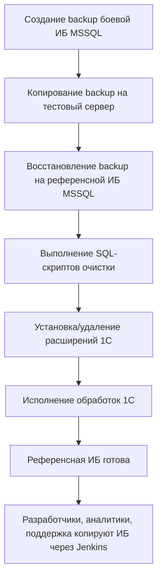

Вот пример схемы развертывания тестовых БД в формате Markdown для GitHub. Схема описывает процесс по шагам, как вы просили.

# Схема развертывания тестовых БД

## Описание процесса

1. **Создание резервной копии боевой ИБ**
   - Ежедневно в 22:00 на боевом сервере создаётся резервная копия 1С ИБ (MSSQL).

2. **Копирование и восстановление на тестовом сервере**
   - Ежедневно в 00:00 копия резервной копии разворачивается на референсной 1С ИБ (MSSQL) на тестовом сервере.

3. **Постобработка референсной ИБ**
   - После восстановления референсной ИБ выполняются:
     - SQL-скрипты очистки ИБ от "тяжелых" данных.
     - Установка и удаление расширений в 1С ИБ.
     - Исполнение дополнительных обработок 1С.

4. **Копирование референсной ИБ для разработчиков, аналитиков и поддержки**
   - Разработчики, аналитики и поддержка копируют референсную ИБ в свою ИБ при помощи сценария Jenkins.

## Схема

## Дополнительные комментарии

- Все шаги автоматизированы через cron-задачи и сценарии Jenkins.
- Для копирования ИБ используется стандартный механизм резервного копирования и восстановления 1С.
- SQL-скрипты и обработки 1С хранятся в репозитории и запускаются автоматически после восстановления.
- Референсная ИБ используется как эталон для разработки и тестирования.

---

Этот файл можно использовать как документацию в репозитории GitHub.
